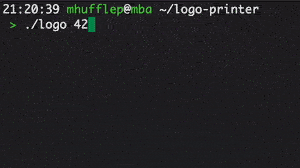

# logo-printer



## Install 
Just run `make` in terminal.

## Use
```bash
./logo <your_message>
```

Only latin letters and digits are allowed.

## Customize
There are several settings in [logo.h](./include/logo.h) that can be changed:

```c
// Horizontal and vertical scale of the image
# define SCALE_Y 4 
# define SCALE_X 2

// Randomizer will pick ASCII symbol from RANDOM_MIN to RANDOM_MAX inclusively.
# define RANDOM_MAX '~'
# define RANDOM_MIN ' '

// Delay between each frame
# define DELAY_BTWN_FRAMES_MS 10000

// Delay between every animation cycle
# define DELAY_BTWN_ITER_MS 1000000

```

